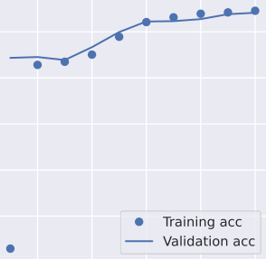
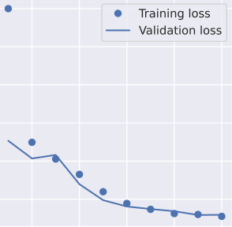

# NLP - BILSTM-CRF Named-Entity_Recognition

# Architecture

<center></center>

# [Dataset](input/ner_dataset.csv)

| Sentence #  | Word        | POS | Tag     |
| ----------- | ----------- | --- | ------- |
| Sentence: 0 | studies     | NNS | O       |
| Sentence: 0 | on          | IN  | O       |
| Sentence: 0 | magnesium   | NN  | O       |
| Sentence: 0 | s           | NN  | O       |
| Sentence: 0 | mechanism   | NN  | O       |
| Sentence: 0 | of          | IN  | O       |
| Sentence: 0 | action      | NN  | O       |
| Sentence: 0 | in          | IN  | O       |
| Sentence: 0 | digitalis   | NN  | plant   |
| Sentence: 0 | induced     | VBD | O       |
| Sentence: 0 | arrhythmias | NNS | disease |
...

# Libraries

```yaml
tensorflow
keras
keras-contrib
sklearn-crfsuite
pickle
seqeval
pandas
numpy
matplotlib
seaborn
```
# Config

```yaml
batch_size = 32 
epochs = 10
max_len = 150
embedding = 50 
```

# Model Visualization

 

# Scores

| Averages | Entities | Precision    | Recall       | F-1 Scores   |
| -------- | -------- | ------------ | ------------ | ------------ |
| Micro    | PAD      | 1            | 1            | 1            |
| Micro    | O        | 0,9700065203 | 0,956698821  | 0,9633067127 |
| Micro    | plant    | 0,9884940778 | 0,9884940778 | 0,9884940778 |
| Micro    | disease  | 0,9884940778 | 0,9884940778 | 0,9884940778 |
|          |          |              |              |              |
| Macro    | PAD      | 1            | 1            | 1            |
| Macro    | O        | 0,9700065203 | 0,956698821  | 0,9633067127 |
| Macro    | plant    | 0,9001643335 | 0,9170404243 | 0,9074482884 |
| Macro    | disease  | 0,9001643335 | 0,9170404243 | 0,9074482884 |
|          |          |              |              |              |
| Weighted | PAD      | 1            | 1            | 1            |
| Weighted | O        | 0,9700065203 | 0,956698821  | 0,9633067127 |
| Weighted | plant    | 0,9892060224 | 0,9884940778 | 0,988767089  |
| Weighted | disease  | 0,9892060224 | 0,9884940778 | 0,988767089  |

# Predict

```yaml
Word           ||True ||Pred
==============================
tobacco        : plant plant
related        : O     O
cancers        : disease disease
in             : O     O
madras         : O     O
india          : O     O
```

# Model Summary

```yaml
Model: "model_1"
_________________________________________________________________
Layer (type)                 Output Shape              Param #   
=================================================================
input_1 (InputLayer)         (None, 150)               0         
_________________________________________________________________
embedding_1 (Embedding)      (None, 150, 50)           154550    
_________________________________________________________________
bidirectional_1 (Bidirection (None, 150, 100)          40400     
_________________________________________________________________
time_distributed_1 (TimeDist (None, 150, 50)           5050      
_________________________________________________________________
crf_1 (CRF)                  (None, 150, 4)            228       
=================================================================
Total params: 200,228
Trainable params: 200,228
Non-trainable params: 0
_________________________________________________________________
```

# Model Output

```yaml
-rwxrwxrwx 1 dimas dimas 8.7K Jul  2 00:41 accuracy.png
-rwxrwxrwx 1 dimas dimas 9.5K Jul  2 00:41 loss.png
-rwxrwxrwx 1 dimas dimas 1.6M Jun 25 18:09 model.h5
-rwxrwxrwx 1 dimas dimas  15K Jun 25 18:05 model.png
-rwxrwxrwx 1 dimas dimas   60 Jun 25 18:14 tag_to_index.pickle
-rwxrwxrwx 1 dimas dimas  61K Jun 25 18:14 word_to_index.pickle
```